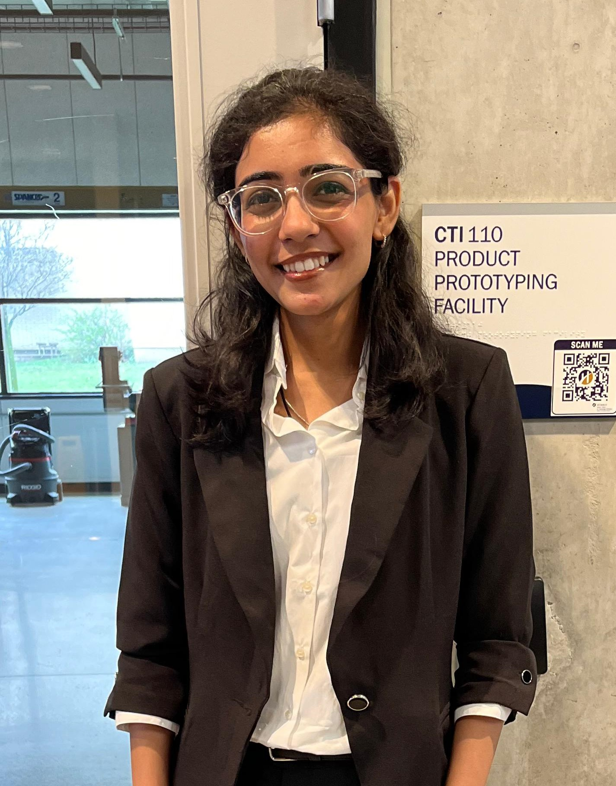

  

###

  

###

  

###

<h1 align="center">hey there 👋</h1>

###

<h3 align="left">👩‍💻  About Me</h3>

###

I'm Aanal Panchal, a skilled Java developer with over 2 years of experience. I'm passionate about developing innovative solutions through code.
  - 🎓 I graduated from Humber College in April 2024 with a degree in Information Technology Solutions. Ready to tackle new challenges in tech! - 💻 Passionate about software development, constantly exploring new technologies and pushing boundaries to learn and grow. - 🚀 I'm excited to collaborate with like-minded individuals and teams who share my passion for innovation and excellence. Let's connect and create something remarkable together!  - 📫 Feel free to reach out on GitHub or other platforms. I'm always up for discussing tech and coding. Let's start this coding adventure together!

###

<h3 align="left">🛠 Language and tools</h3>

###

  
  
  
  
  
  
  
  
  
  
  
  
  
  
  
  
  

###

<h3 align="left">🔥   My Stats :</h3>

###

  

###